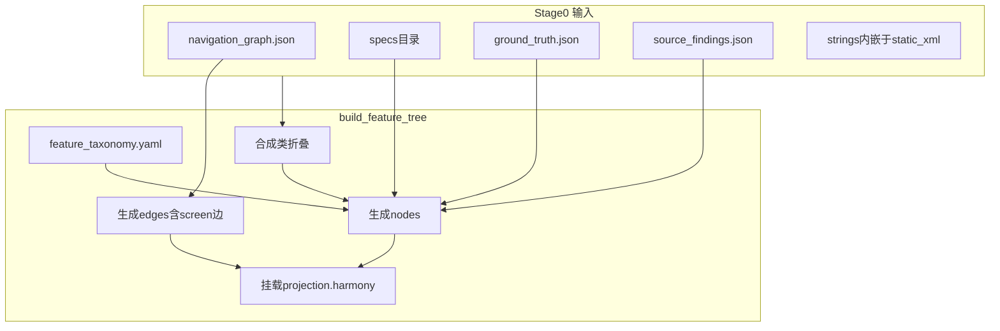

# Feature Tree（功能树）与可视化：完整设计

**文档版本**：2026-04-26  
**状态**：设计定稿，供实现阶段对照  
**范围**：[harmony-migration-toolkit](../) 扩展；Stage 0 仍复用 [spec-tools-for-opencode](../../spec-tools-for-opencode)。

---

## 1. 背景与目标

### 1.1 现状

当前工具链产出以 **扁平 `screens[]`**（[`android_facts.v1`](../schemas/android_facts.v1.schema.json)）和 **鸿蒙架构占位**（`harmony_arch`）为主，缺少：

- 统一的 **功能域（feature）** 与 **屏（screen）**、**UI**、**行为**、**实现锚点** 的可追溯图模型；
- **屏与屏之间关系** 的结构化表达（与 `navigation_graph` 一致且可折叠合成类）；
- **可复现的交互式可视化**，便于评审与迁移对齐。

### 1.2 目标

| 目标 | 说明 |
|------|------|
| **单一权威 IR** | `feature_tree.v1.json`：有向图（树 + 跨边），Schema 校验，可 diff。 |
| **覆盖维度** | Screen、UI（surface/control）、静态可抽取的 **behavior**、**implementation** 锚点（文件/行/符号）。 |
| **鸿蒙对齐** | 同一 `node_id` / `logical_feature_id` 上挂 `projection.harmony`；不另造一套互斥的业务树。 |
| **可视化** | 静态 HTML + 图库（推荐 vis-network），三栏布局，筛选与详情只读。 |
| **确定性** | 同输入仓 + 同工具版本 + 同规则表版本 → 同 IR/同 HTML；LLM 不参与 IR 合并。 |

### 1.3 非目标（首版明确不做）

- 不生成可编译的完整 ArkTS 业务实现；
- 不从自然语言推断产品需求；
- 不在首版要求 **最短路径**、**PNG 导出**（可列二期）；
- 不把 LLM 输出写回 `feature_tree` 主文件。

---

## 2. 核心产物与目录

建议在 `out/` 下统一阶段目录（实现时可微调编号，但保持语义）：

| 路径 | 说明 |
|------|------|
| `0_android_facts/` | 现有：spec-tools 拷贝 + manifest + 路径归一化 |
| `1_android_facts/android_facts.v1.json` | 现有；**需增强** manifest / applicationId（见第 9 节） |
| `5_feature_tree/feature_tree.v1.json` | **新增**：功能树主 IR |
| `2_framework_map/` … | 现有；可与 `gap_items` 侧车共用 |
| `3_harmony_arch/` … | 现有；**可选**由 `feature_tree` 驱动增强 routes |
| `viewer/` | **新增**：见第 7 节 |

---

## 3. `feature_tree.v1` 信息模型

### 3.1 顶层字段（建议）

- `schema_version`: `"1.0"`
- `platform`: `"android"`（鸿蒙侧未来同源文件可为 `"harmony"`）
- `android_root`: 分析根路径（建议相对或规范化为 posix）
- `ui_fidelity`: `high_xml` | `mixed` | `low_for_compose`（继承或复算自现有逻辑）
- `taxonomy_version`: 与 [`data/feature_taxonomy.yaml`](../data/feature_taxonomy.yaml)（待新增）版本对齐
- `nodes`: 数组
- `edges`: 数组
- `meta`: 可选（生成时间、spec-tools 版本、节点数统计等）

### 3.2 节点 `node`（共同字段）

| 字段 | 类型 | 说明 |
|------|------|------|
| `node_id` | string | 全局唯一、稳定（合成类折叠后不变冲突） |
| `kind` | enum | 见下表 |
| `label` | string | 短标题，供可视化 |
| `logical_feature_id` | string? | 来自 taxonomy，如 `bookmark.manage` |
| `evidence` | object? | 来源文件、规则 id 等 |
| `projection` | object? | `{ "harmony": { ... } }` 见 3.5 |

### 3.3 `kind` 枚举与含义

| kind | 含义 | 主要来源 |
|------|------|----------|
| `product_root` | 应用根 | manifest / applicationId |
| `feature` | 功能域 | `feature_taxonomy.yaml`：包前缀、类名前缀、strings 分类等 |
| `screen` | 一屏（Activity / Fragment / Dialog **宿主类**） | `navigation_graph.nodes`；合成类折叠入宿主 |
| `ui_surface` | 布局或 Compose 占位容器 | `layout` + `specs/*_spec.json` |
| `ui_control` | 可交互控件 | XML id、spec `ui_elements` |
| `behavior` | 静态可描述行为 | `ground_truth`、`source_findings` |
| `implementation` | 实现锚点 | 文件路径、行号、`enclosing_fn`、`component` 等 |

### 3.4 边 `edge`

| 字段 | 类型 | 说明 |
|------|------|------|
| `edge_id` | string | 可选；或由 `from+to+rel+序号` 确定性生成 |
| `from` / `to` | string | `node_id` |
| `rel` | string | 见 4.2 |
| `determinism` | `rule` \| `static_analysis` | |
| `via` / `trigger` / `source` | string? | 与 spec-tools `navigation_graph` 边字段对齐，便于审计 |
| `via_behavior_id` | string? | 可选：指向中间 `behavior` 节点 |

允许的非 screen 边示例：`parent_of`、`owns_ui`、`implements`、`evidence_in_file` 等。

### 3.5 `projection.harmony`（节点上可选）

| 字段 | 说明 |
|------|------|
| `ability_name` | 如 `EntryAbility` |
| `route_placeholder` | 如 `pages/foo/Index` |
| `module` | Harmony 模块名占位 |
| `gap_ref` | 指向 `framework_map.gap_items[].id` 或内部未解析 id |

**规则**：Android 拓扑与证据不随投影改变；投影缺失或 `gap_ref` 非空时，可视化用 **橙色描边**（见第 7 节）。

---

## 4. Screen 与 Screen 之间的关系

### 4.1 原则

- 不维护第二套「仅 screen」图；**screen↔screen** 关系全部是 **`edges[]` 中 `from`/`to` 对应 `kind: screen` 的节点**。
- Kotlin **合成类**先映射到 **宿主 `node_id`**，再连边，避免 `$lambda$` 爆炸。

### 4.2 `rel` 枚举（首版）

| rel | 语义 |
|-----|------|
| `navigates_to` | 典型 Activity 跳转 |
| `presents_modal` | Dialog / BottomSheet 叠在当前屏上 |
| `embeds_fragment` | 同 Activity 内 Fragment（仅当静态可解析） |
| `returns_to` | 可选；首版可不生成 |
| `deep_links_to` | Intent filter / deep link（若扫描到） |

### 4.3 细化：经 `behavior` 或 `ui_control`

「从 A 的某菜单到 B」：

- 方案 A：`A --owns_ui--> control --triggers--> behavior --navigates_to--> B`（边类型可再细化为 `triggers` 等，首版可简化）。
- 方案 B：单条 `navigates_to` + `via_behavior_id` 指向 `behavior` 节点。

可视化可对 A→B 做 **聚合边**（二期交互）。

### 4.4 鸿蒙映射（策略表，非代码）

| rel | Harmony 策略（占位） |
|-----|----------------------|
| `navigates_to` | `router.push` / 启动另一 `UIAbility` |
| `presents_modal` | 自定义弹窗 / 全屏模态页 |
| `embeds_fragment` | 子页面 / `NavDestination` 占位 |

无法映射 → **仅** `gap_ref`，不修改 Android 边。

---

## 5. 数据来源与构建逻辑（概要）



**实现要点**：

1. **screen 节点**：自 `navigation_graph.nodes`；`type` 映射到 `screen` + 元数据（layout、activity/dialog）。
2. **合成类折叠**：规则同现有 [`is_synthetic_kotlin_class`](../stages/_util.py)；子类合并到宿主 `node_id`，边重写端点。
3. **feature 节点**：由 `feature_taxonomy.yaml` 匹配 `logical_feature_id`，`parent_of` 连到 `product_root` 或互连。
4. **UI 子树**：按 `layout` / spec 文件名关联到最近 screen（启发式：类名↔layout 映射表来自 `navigation_graph.class_layouts`）。
5. **behavior / implementation**：遍历 `source_findings.findings` 下各列表，按 `file` 路径推断所属模块与最近 screen（包前缀、目录 `activity/`、`dialog/` 等规则）；**行号**必填。

---

## 6. 流水线与 CLI

### 6.1 阶段表（建议）

| Stage | 名称 | 产物 |
|-------|------|------|
| 0 | spec-tools 包装 | `0_android_facts/` |
| 1 | android_facts | `1_android_facts/android_facts.v1.json` |
| 2 | framework_map | 现有 |
| 3 | harmony_arch | 现有（可选消费 feature_tree） |
| 4 | scaffold | 现有 |
| **5** | **feature_tree** | `5_feature_tree/feature_tree.v1.json` |
| **6** | **viewer** | `viewer/*` |

实现时可将 Stage 5 插在 1 之后、2 之前，以便 `harmony_arch` 消费 feature_tree；**以依赖顺序为准**，编号可在 `pipeline.py` 中集中定义常量。

### 6.2 CLI

- `python pipeline.py --android-root ... --out ... --stages 0,1,5,2,3,4,6`
- `--stages 5,6` 在已有 `0_android_facts` 时快速迭代可视化。

---

## 7. 可视化设计（Viewer）

### 7.1 原则

- 确定性：固定 **viewer 模板版本** + vendor 内置 **vis-network**（推荐），不运行时拉「latest」CDN。
- 主图数据：**仅** `feature_tree.v1.json`。
- **侧车**：`framework_map_sidecar.json`（`gap_items` + `rules_version`）、`harmony_arch_sidecar.json`（abilities/routes 缩略），可选加载。

### 7.2 布局：顶栏 + 三栏

| 区域 | 功能 |
|------|------|
| 顶栏 | 标题、节点/边计数、`rules_version`、布局切换（层次/力导）、搜索 |
| 左栏 | 按 `kind` / `rel` 筛选；「仅 feature+screen」；隐藏 `implementation`；1-hop 聚焦 |
| 中栏 | vis-network 画布；边 hover 显示 `via` / `trigger` / `source` |
| 右栏 | 节点详情、`projection.harmony`、`implementation` 锚点列表（可复制 `path:line`） |

窄屏：左右栏改为抽屉。

### 7.3 视觉编码

| 维度 | 规则 |
|------|------|
| 节点颜色 / group | `kind` |
| 节点形状 | `feature` 圆角矩形、`screen` 椭圆、`implementation` 小点等 |
| 边线型 | `presents_modal` → 虚线 + 浅色；`navigates_to` → 实线 |
| 鸿蒙 | 有投影且无 `gap_ref` → 绿描边；有 `gap_ref` → 橙描边 |

### 7.4 大图降级

- 节点数 > 阈值（默认 **800**，可配置）→ 默认打开「仅 feature+screen」，并 toast 提示。

### 7.5 产物目录

```
viewer/
  feature_tree.html
  feature_tree.v1.json              # 可拷贝自 5_feature_tree/
  framework_map_sidecar.json        # 可选
  harmony_arch_sidecar.json         # 可选
  README_viewer.txt
  vendor/vis-network.min.js           # 推荐内置
```

**生成**：`stages/export_feature_tree_view.py --tree ... --out viewer/`（实现时落地）。

**打开**：README 说明 `python -m http.server`；`file://` 限制简述。

---

## 8. LLM 与人工边界

| 允许 | 禁止 |
|------|------|
| 根据 `gap_ref` / `gap_items` 生成 `llm_out/*` 草稿 | 修改 `feature_tree` 主 JSON 的拓扑与证据 |
| 人工编辑 `gap_fill.json` 后由独立脚本合并 | LLM 直接写 `navigation_graph` 或 rules.yaml |

详见现有 [prompts/gap_prompt.md](../prompts/gap_prompt.md)（实现后可指向 `gap_ref`）。

---

## 9. Android 元数据质量（与功能树并行）

**问题**：`applicationId` / launcher 解析失败会导致 `product_root` 与 `harmony_arch.bundle_name` 不准。

**增强**（[`stages/_util.py`](../stages/_util.py)）：

- 解析 **`app/build.gradle.kts`**：`applicationId`、`namespace`；
- **主 Manifest**：优先 `app/src/main/AndroidManifest.xml` 的 `MAIN`/`LAUNCHER`，解析 `android:name`（相对类名拼 `namespace`）。

---

## 10. Schema 与测试

### 10.1 Schema 文件

- 新增：`schemas/feature_tree.v1.schema.json`（`nodes`、`edges`、`rel` 枚举、`projection` 结构）。

### 10.2 测试

- 扩展 `fixtures/minimal_facts`：最小 spec + `event_registration`；
- `pytest`：跑 pipeline 子集，**jsonschema 校验** + 可选「最小节点/边数量」断言。

---

## 11. 分阶段实现清单（建议）

| 阶段 | 内容 |
|------|------|
| **P0** | Schema + `build_feature_tree.py` 骨架（仅 `product_root` + `screen` + `navigates_to`/`presents_modal` 边 from navigation_graph + 折叠） |
| **P1** | taxonomy + `feature` 节点；UI 子树从 spec；manifest 修复 |
| **P2** | `behavior` + `implementation` 锚点；与 `harmony_arch` 联动 |
| **P3** | `export_feature_tree_view.py` + vendor + 三栏 UI |
| **P4** | 侧车 gap、最短路径、PNG（按需） |

---

## 12. 与 Cursor 计划文档的关系

Cursor 内计划文件（如 `VerifyFix/.cursor/plans/功能树_ir_扩展_31d9acf0.plan.md`）可作任务追踪；**以本文档为设计单一事实来源（SSOT）**；计划中的 todo 与本文章节对应实现即可。

---

## 13. 参考路径

| 组件 | 路径 |
|------|------|
| 现有流水线 | [pipeline.py](../pipeline.py) |
| Stage0 | [stages/stage0_run_spec_tools.py](../stages/stage0_run_spec_tools.py) |
| Android facts | [stages/build_android_facts.py](../stages/build_android_facts.py) |
| 工具根 README | [README.md](../README.md) |
