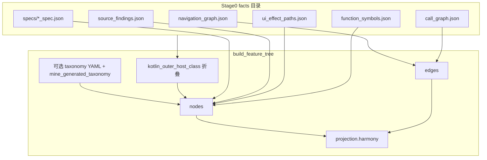

# Feature Tree（功能树）、Agent Bundle 与可选可视化：完整设计

**文档版本**：2026-05-07  
**状态**：与当前 `pipeline.py` / `build_feature_tree.py` / `export_agent_bundle.py` 实现对齐；本文档为功能树与 Agent Bundle 设计的单一事实来源（SSOT）。  
**范围**：[harmony-migration-toolkit](../)；Stage 0 运行内置 [`bundled_spec_tools/`](../bundled_spec_tools/)（或 `--facts-source` 预置产物）。

---

## 1. 背景与目标

### 1.1 现状

当前工具链产出以 **扁平 `screens[]`**（[`android_facts.v1`](../schemas/android_facts.v1.schema.json)）和 **鸿蒙架构占位**（`harmony_arch`）为主，缺少：

- 统一的 **功能域（feature）** 与 **屏（screen）**、**UI**、**行为**、**实现锚点** 的可追溯图模型；
- **屏与屏之间关系** 的结构化表达（与 `navigation_graph` 一致且可折叠合成类）；
- **以 bundle 为首选入口**，并按需跟随 `outline.artifacts` 打开少量 JSON（通常为功能树全图与校验报告），避免无结构地遍历整个 `intermediate/`；
- **可复现的交互式可视化**，仅作为可选调试/评审输出。

### 1.2 目标

| 目标 | 说明 |
|------|------|
| **最终 agent 产物** | `agent_bundle.v1.json`：单文件摘要 + 大纲 + artifact 指针；**完整功能树**见 `intermediate/5_feature_tree/feature_tree.v1.json`。 |
| **核心图 IR** | `intermediate/5_feature_tree/feature_tree.v1.json`：有向图（树 + 跨边），Schema 校验，可 diff。 |
| **覆盖维度** | Screen、UI（surface/control）、静态可抽取的 **behavior**、**implementation** 锚点（文件/行/符号）。 |
| **鸿蒙对齐** | 同一 `node_id` / `logical_feature_id` 上挂 `projection.harmony`；不另造一套互斥的业务树。 |
| **可视化** | 可选 debug viewer：静态 HTML + 图库（vis-network），三栏布局，筛选与详情只读。 |
| **确定性** | 同输入仓 + 同工具版本 + 同规则表版本 → 同 IR/同 HTML；LLM 不参与 IR 合并。 |

### 1.3 非目标（首版明确不做）

- 不生成可编译的完整 ArkTS 业务实现；
- 不从自然语言推断产品需求；
- 不在首版要求 **最短路径**、**PNG 导出**（可列二期）；
- 不把 LLM 输出写回 `feature_tree` 主文件。

---

## 2. 核心产物与目录

默认输出目录为 **`<android-root>/harmony_migration_out`**（`--out` 可覆盖）。根目录保持精简：**完整功能树不内联在 bundle 中**，由 `outline.artifacts` 指向 `intermediate/` 下 JSON。

| 路径 | 说明 |
|------|------|
| `agent_bundle.v1.json` | **最终交付**：摘要 + 大纲 + 中间件清单 + `agent_hints`（见 §2.1；Schema 见 §11） |
| `intermediate/0_android_facts/` | Stage 0 每次运行的隔离 scan 输出完整镜像（不限定文件名）+ 路径归一化 + 根目录 `manifest.json`（阶段清单） |
| `intermediate/1_android_facts/android_facts.v1.json` | Android 摘要 IR |
| `intermediate/2_framework_map/framework_map.v1.json` | 框架映射与 `gap_items`（规则表 [`data/framework_map/rules.yaml`](../data/framework_map/rules.yaml)） |
| `intermediate/3_harmony_arch/harmony_arch.v1.json` | Harmony 模块 / Ability / route 占位 |
| `intermediate/4_scaffold/` | 可选 scaffold 文件（`--emit-scaffold-files`）；默认 Stage 4 仅 stdout dry-run |
| `intermediate/5_feature_tree/feature_tree.v1.json` | 功能树主 IR（权威有向图） |
| `intermediate/5_feature_tree/feature_spec_evidence.json` | feature → 规范与源码锚点 |
| `intermediate/5_feature_tree/verify_report.json` | 静态验证、缺失证据、unresolved calls 等 |
| `intermediate/5_feature_tree/taxonomy_report.json` | 功能域：生成聚类统计、`unmatched_screens`、显式规则来源 |
| `viewer/` | 仅 `--stages ... ,6` 时生成在 **`<out>/viewer/`**；需 toolkit 内 [`viewer/`](../viewer/) 存在（HTML + `vendor/`） |

### 2.1 `agent_bundle.v1.json` 顶层结构（实现）

bundle **不嵌入**全量 `nodes`/`edges`；全图请读 `outline.artifacts.feature_tree` 所指路径（测试亦断言根对象无 `feature_tree` 键）。

```json
{
  "schema_version": "1.0",
  "bundle_kind": "harmony_migration_agent_bundle",
  "meta": {
    "feature_tree": {},
    "verification_status": "",
    "taxonomy_summary": {},
    "framework_rules_version": "",
    "harmony_bundle_name": ""
  },
  "agent_hints": {},
  "summary": {},
  "outline": {
    "app": {},
    "features": [],
    "migration": {},
    "verification": {},
    "taxonomy": {},
    "artifacts": {}
  },
  "intermediate_manifest": {
    "root": "",
    "artifact_count": 0,
    "artifacts": {}
  }
}
```

- **`meta.feature_tree`**：`node`/`edge` 计数、`nodes_by_kind`、`edges_by_rel`、`coverage` 等摘要。
- **`outline.features`**：按 feature 的精简列表（条数上限约 256），含 `taxonomy_source`、`top_tokens`、`representative_screens` 等。
- **`outline.app`**：manifest、Gradle 模块、`navigation_summary`、`ui_fidelity`、Stage0 `artifact_checks`、`ui_paths_legacy` 计数等。`ui_paths_legacy` 为 **探索链**与 **合格单步 legacy 文案** 的去重并集（大型工程中静态 DAG 深层链少时仍保有覆盖面），详见 Stage0 `ui_paths_display_quality_report.json` 的 `policy` 与 `summary`。
- **`outline.artifacts.*`**：指向 `intermediate/...` 各 JSON，含 `bytes` 字段便于体量感知。

---

## 3. `feature_tree.v1` 信息模型

### 3.1 顶层字段（与 Schema 一致）

- `schema_version`: `"1.0"`
- `platform`: `"android"`（鸿蒙侧未来同源文件可为 `"harmony"`）
- `android_root`: 分析根路径
- `ui_fidelity`: `high_xml` | `mixed` | `low_for_compose`（来自 `android_facts`）
- `taxonomy_version`: 与 `--taxonomy` 指定 YAML 顶层的 `version` 一致；**未传入任何基础 taxonomy 文件**时为 `"1.0"`（覆盖层 `--taxonomy-overlay` 不改变该字段，除非同时提供 `--taxonomy`）
- `nodes` / `edges`: 数组
- `meta`: 包含 `node_count`、`edge_count`、`coverage`（spec 覆盖、effect path、`function_symbol` / `behavior` 统计等）

### 3.2 节点 `node`（共同字段）

| 字段 | 类型 | 说明 |
|------|------|------|
| `node_id` | string | 全局唯一、稳定（合成类折叠后不变冲突） |
| `kind` | enum | 见下表 |
| `label` | string | 短标题，供可视化 |
| `logical_feature_id` | string? | 来自自动生成 taxonomy 或可选 YAML（如 `generated.settings`、`bookmark.manage`） |
| `evidence` | object? | 来源文件、规则 id 等 |
| `projection` | object? | `{ "harmony": { ... } }` 见 3.5 |

### 3.3 `kind` 枚举与含义

| kind | 含义 | 主要来源 |
|------|------|----------|
| `product_root` | 应用根 | manifest / applicationId |
| `feature` | 功能域 | 确定性 token 聚类 + 可选 `--taxonomy` / `--taxonomy-overlay` YAML |
| `screen` | 一屏（Activity / Fragment / Dialog **宿主类**） | `navigation_graph.nodes`；合成类折叠入宿主 |
| `ui_surface` | 布局或 Compose 占位容器 | `0_android_facts/specs/*_spec.json` |
| `ui_control` | 可交互控件 | spec `ui_elements` |
| `behavior` | UI 效果路径（含入口符号锚点） | **`ui_effect_paths.json`**（`evidence.source` 为 `ui_effect_paths.json`） |
| `function_symbol` | 函数符号节点 | **`function_symbols.json`** |
| `implementation` | 实现锚点 | **`source_findings.json`**（`findings` 各 bucket） |

### 3.4 边 `edge`

| 字段 | 类型 | 说明 |
|------|------|------|
| `edge_id` | string | 可选；或由 `from+to+rel+序号` 确定性生成 |
| `from` / `to` | string | `node_id` |
| `rel` | string | 见 4.2 |
| `determinism` | `rule` \| `static_analysis` | |
| `via` / `trigger` / `source` | string? | 与静态扫描器 `navigation_graph` 边字段对齐，便于审计 |
| `via_behavior_id` | string? | 可选：指向中间 `behavior` 节点 |

允许的非 screen 边示例：`parent_of`、`owns_ui`、`implements`、`evidence_in_file` 等。

### 3.5 `projection.harmony`（节点上可选）

| 字段 | 说明 |
|------|------|
| `ability_name` | 如 `EntryAbility` |
| `route_placeholder` | 如 `pages/foo/Index` |
| `module` | Harmony 模块名占位 |
| `gap_ref` | 指向 `framework_map.gap_items[].id` 或内部未解析 id |

**规则**：Android 拓扑与证据不随投影改变；投影缺失或 `gap_ref` 非空时，可选 viewer 用 **橙色描边**（见第 8 节）。

---

## 4. Screen 与 Screen 之间的关系

### 4.1 原则

- 不维护第二套「仅 screen」图；**screen↔screen** 关系全部是 **`edges[]` 中 `from`/`to` 对应 `kind: screen` 的节点**。
- Kotlin **合成类**先映射到 **宿主 `node_id`**，再连边，避免 `$lambda$` 爆炸。

### 4.2 `rel` 枚举（Schema + 当前生成器）

**导航类**（`navigation_graph.json` → screen 之间，`determinism`: `static_analysis`）：

| rel | 语义 |
|-----|------|
| `navigates_to` | Activity 类跳转 |
| `presents_modal` | Dialog / BottomSheet / `commons_dialog` 等叠屏 |
| `embeds_fragment` | 同 Activity 内 Fragment（静态可解析时） |
| `returns_to` | 预留 |
| `deep_links_to` | 预留 / deep link |

**图结构与证据类**（feature/UI/符号/行为）：

| rel | 语义 |
|-----|------|
| `parent_of` | product→feature→screen/behavior、feature→behavior、未匹配屏挂根等 |
| `owns_ui` | screen→`ui_surface`→`ui_control` |
| `triggers` | screen→`behavior` |
| `enters` | behavior→`function_symbol`（入口方法） |
| `implements` | screen→`implementation` |
| `evidence_in_file` | `function_symbol`→`implementation` |
| `calls` | `function_symbol`→`function_symbol`（**`call_graph.json`**） |

### 4.3 细化：经 `behavior` 或 `ui_control`

「从 A 的某菜单到 B」：

- 方案 A：`A --owns_ui--> control --triggers--> behavior --navigates_to--> B`（边类型可再细化为 `triggers` 等，首版可简化）。
- 方案 B：单条 `navigates_to` + `via_behavior_id` 指向 `behavior` 节点。

可视化可对 A→B 做 **聚合边**（二期交互）。

### 4.4 鸿蒙映射（策略表，非代码）

| rel | Harmony 策略（占位） |
|-----|----------------------|
| `navigates_to` | `router.push` / 启动另一 `UIAbility` |
| `presents_modal` | 自定义弹窗 / 全屏模态页 |
| `embeds_fragment` | 子页面 / `NavDestination` 占位 |

无法映射 → **仅** `gap_ref`，不修改 Android 边。

---

## 5. 数据来源与构建逻辑（概要）



**实现要点**：

1. **screen 节点**：来自 `navigation_graph` 的节点与边端点；宿主类名经 [`kotlin_outer_host_class`](../stages/_util.py) 折叠 Kotlin 合成类。
2. **feature 节点**：**无捆绑默认 taxonomy**。先用 `--taxonomy` / `--taxonomy-overlay` 的 YAML 规则做「首条命中」分配；其余屏幕由 [`mine_generated_taxonomy`](../stages/feature_taxonomy_miner.py) 基于类名/layout/包路径 token + 导航邻接做确定性聚类。`taxonomy_report.json` 的 `source` 取值包括 `generated_taxonomy`、`explicit_taxonomy`、`generated+explicit_taxonomy`、`none`。
3. **feature/screen 边 `source` 字段**：显式规则 → `explicit_taxonomy`；挖掘生成 → `generated_taxonomy`；未归入任何 feature 的 screen → 仍由 `product_root` `parent_of` 连接，`source` 为 `taxonomy_unmatched_screen`。
4. **导航边**：自 `navigation_graph.edges`，映射 `rel`（见 §4.2），附带 `via` / `trigger` / `line` 等保留可追溯字段。
5. **UI 子树**：遍历 `0_android_facts/specs/*_spec.json`，挂 `ui_surface` / `ui_control`，`owns_ui` 连到对应 screen（类名与 spec `class` 对齐并折叠）。
6. **behavior**：遍历 **`ui_effect_paths.json`**（须含 `source_file` 与 `line`）；`enters` 连到 **`function_symbols.json`** 解析到的入口符号；`triggers` 连到宿主 screen；`logical_feature_id` 取自解析到的目标 screen 所属 feature。
7. **implementation**：遍历 **`source_findings.json`** → `implementation` 节点；与 screen / `function_symbol` 的连边见 §4.2。
8. **calls**：自 **`call_graph.json`**，两端符号均在图中存在时添加 `function_symbol` 之间的 `calls` 边。
9. **projection.harmony**：当 Stage 3 已生成且传入 `harmony_arch.v1.json` 时，按 screen 尝试挂载 route 占位；缺映射时 `gap_ref`（如 `UNMAPPED_ROUTE`、Compose 低保真叠加）。

---

## 6. 流水线与 CLI

### 6.1 阶段表

| Stage | 名称 | 产物 |
|-------|------|------|
| 0 | `bundled_spec_tools`（`main.py`） | `intermediate/0_android_facts/` |
| 1 | android_facts | `intermediate/1_android_facts/android_facts.v1.json` |
| 2 | framework_map | `intermediate/2_framework_map/framework_map.v1.json` |
| 3 | harmony_arch | `intermediate/3_harmony_arch/harmony_arch.v1.json` |
| 4 | scaffold | stdout，或 `intermediate/4_scaffold/` |
| **5** | **feature_tree** | `intermediate/5_feature_tree/feature_tree.v1.json` + sidecars |
| **6** | **viewer** | 可选 debug `viewer/*` |
| **7** | **agent_bundle** | 根目录 `agent_bundle.v1.json` |

默认 stage 顺序是 `0,1,2,3,5,4,7`。Viewer 不再默认生成，避免最终交付混入人类浏览用 artifact。

### 6.2 CLI（节选）

- `python pipeline.py --android-root PATH [--out DIR]` — 默认 `--stages 0,1,2,3,5,4,7`。
- `--stages 5,7` — 在已有 `0_android_facts`、`1_android_facts` 下刷新功能树与 bundle（Stage 7 仍会校验 Stage 2/3 产物是否存在；完整刷新通常带 `2,3`）。
- `--taxonomy PATH` / `--taxonomy-overlay PATH`（可重复）— Stage 5 可选显式功能域规则（**无默认 bundled YAML**）。
- `--facts-source DIR` — 拷贝预置 facts 到 `0_android_facts`，跳过 Stage 0 扫描（测试与离线场景）。
- `--skip-spec-tools` — 显式复用已有 `bundled_spec_tools/output/`（或 `--spec-tools-root` 指向目录下的 `output/`），仅建议调试/缓存场景使用。
- `--emit-scaffold-files` — Stage 4 写入 `4_scaffold/` 而非仅 stdout。
- `--stages ...,6` — 导出 `<out>/viewer/`（依赖 toolkit [`viewer/`](../viewer/) 目录完整）。

---

## 7. Agent Bundle 设计

### 7.1 原则

- **单文件入口**：Agent 默认从 `agent_bundle.v1.json` 读摘要与大纲；**全图在单独文件中**，避免 bundle 体积失控。
- **结构化**：字段符合 `schemas/agent_bundle.v1.schema.json`，通过 `jsonschema` 校验。
- **可追溯**：`outline.artifacts` 指针 + `intermediate_manifest.artifacts` 体量（`bytes`）；需要拓扑时打开 `feature_tree.v1.json`。
- **hints**：`agent_hints` 给出推荐阅读顺序（artifacts 路径、`verification`、`gap` 等）。

### 7.2 Agent 消费建议

| 位置 | 用途 |
|------|------|
| `outline.artifacts.feature_tree` | **迁移主图**路径 → `feature_tree.v1.json` |
| `outline.artifacts.evidence` | `feature_spec_evidence.json` |
| `outline.artifacts.verification` | `verify_report.json` |
| `outline.artifacts.taxonomy` | `taxonomy_report.json` |
| `outline.artifacts.harmony_projection` | `harmony_arch.v1.json` |
| `outline.artifacts.framework_mapping` | `framework_map.v1.json`（含 `gap_items`） |
| `outline.artifacts.android_facts` | `android_facts.v1.json` |
| `outline.features` | 快速浏览 feature 列表（非全图） |
| `meta.feature_tree` | 节点/边计数与 `coverage` 摘要 |
| `intermediate_manifest` | 列出 `intermediate/` 下文件的相对路径与 `bytes` |

---

## 8. 可选可视化设计（Viewer）

### 8.1 原则与前置条件

- 确定性：使用 toolkit 内固定 **HTML 模板** + 本地 **`vendor/vis-network.min.js`**（不依赖运行时 CDN）。
- **前置条件**：仓库中必须存在 [`viewer/feature_tree.html`](../viewer/feature_tree.html) 与 [`viewer/vendor/`](../viewer/vendor/)；缺失时 Stage 6 会在拷贝阶段失败。
- 主图数据：导出时复制的 **`feature_tree.v1.json`**（同源 `intermediate/5_feature_tree/`）。
- **侧车**：同目录 `taxonomy_report.json`、`feature_spec_evidence.json`、`verify_report.json`；以及可选 `framework_map_sidecar.json`、`harmony_arch_sidecar.json`（由导出脚本从对应 IR 裁剪生成）。
- Viewer 仅供人工评审 / debug；不是默认交付，也不是 Agent 主输入。

### 8.2 布局：顶栏 + 三栏

| 区域 | 功能 |
|------|------|
| 顶栏 | 标题、节点/边计数、`rules_version`、布局切换（层次/力导）、搜索 |
| 左栏 | 按 `kind` / `rel` 筛选；「仅 feature+screen」；隐藏 `implementation`；1-hop 聚焦 |
| 中栏 | vis-network 画布；边 hover 显示 `via` / `trigger` / `source` |
| 右栏 | 节点详情、`projection.harmony`、`implementation` 锚点列表（可复制 `path:line`） |

窄屏：左右栏改为抽屉。

### 8.3 视觉编码

| 维度 | 规则 |
|------|------|
| 节点颜色 / group | `kind` |
| 节点形状 | `feature` 圆角矩形、`screen` 椭圆、`implementation` 小点等 |
| 边线型 | `presents_modal` → 虚线 + 浅色；`navigates_to` → 实线 |
| 鸿蒙 | 有投影且无 `gap_ref` → 绿描边；有 `gap_ref` → 橙描边 |

### 8.4 大图降级

- 节点数 > 阈值（默认 **800**，可配置）→ 默认打开「仅 feature+screen」，并 toast 提示。

### 8.5 产物目录

```
viewer/
  feature_tree.html
  feature_tree.v1.json              # 与 intermediate/5_feature_tree 同源拷贝
  taxonomy_report.json              # sidecar（与 intermediate/5_feature_tree 同源）
  feature_spec_evidence.json
  verify_report.json
  framework_map_sidecar.json        # 可选（来自 framework_map 裁剪）
  harmony_arch_sidecar.json         # 可选（来自 harmony_arch 裁剪）
  README_viewer.txt
  vendor/vis-network.min.js         # 随仓库提供
```

**生成**：`pipeline.py --stages ...,6` 或 `stages/export_feature_tree_view.py --tree ... --out viewer/`。

**打开**：README 说明 `python -m http.server`；`file://` 限制简述。

---

## 9. LLM 与人工边界

| 允许 | 禁止 |
|------|------|
| 根据 `gap_ref` / `gap_items` 生成 `llm_out/*` 草稿 | 修改 `feature_tree` 主 JSON 的拓扑与证据 |
| 人工编辑 `gap_fill.json` 后由独立脚本合并 | LLM 直接写 `navigation_graph` 或 rules.yaml |

详见现有 [prompts/gap_prompt.md](../prompts/gap_prompt.md)（实现后可指向 `gap_ref`）。

---

## 10. Android 元数据质量（与功能树并行）

**问题**：`applicationId` / launcher 解析失败会导致 `product_root` 与 `harmony_arch.bundle_name` 不准。

**增强**（[`stages/_util.py`](../stages/_util.py)）：

- 解析 **`app/build.gradle.kts`**：`applicationId`、`namespace`；
- **主 Manifest**：优先 `app/src/main/AndroidManifest.xml` 的 `MAIN`/`LAUNCHER`，解析 `android:name`（相对类名拼 `namespace`）。

---

## 11. Schema 与测试

### 11.1 Schema 文件（流水线校验）

[`schemas/`](../schemas/) 下 JSON Schema Draft **2020-12**，均由 [`pipeline.py`](../pipeline.py) 在写出对应产物后校验：

| Schema | 校验对象 |
|--------|----------|
| `android_facts.v1.schema.json` | Stage 1 |
| `framework_map.v1.schema.json` | Stage 2 |
| `harmony_arch.v1.schema.json` | Stage 3 |
| `feature_tree.v1.schema.json` | Stage 5（含 `function_symbol`、`calls`、`enters` 等） |
| `agent_bundle.v1.schema.json` | Stage 7 |

`intermediate_manifest` 当前为低基数文件记录 **`bytes`**，并省略 `0_android_facts/specs/`、`app_model/features/`、`app_model/screens/`、`app_model/paths/` 等高基数目录（见 `omitted_by_prefix`）。完整 Stage 0 JSON 清单看 `0_android_facts/manifest.json`，其中包含各文件的 `sha256` 与 `bytes`。

### 11.2 测试

- `fixtures/minimal_android` + `fixtures/minimal_facts`：最小端到端。
- 覆盖真实 bundled Stage 0 路径：不使用 `--facts-source`，验证隔离 scan 输出不会复制共享 `bundled_spec_tools/output/` 的旧文件。
- `pytest tests/test_pipeline.py`：全默认 stage 不含 6 时 **不生成** `viewer/`；断言 bundle 内 **`feature_tree` 键不存在**（全图仅经 artifact 引用）。
- Stage 6 测试需在 **viewer 资源齐全** 的检出环境中运行；否则拷贝步骤可能失败。

---

## 12. 实现状态与后续（对照清单）

| 阶段 | 内容 | 状态（截至文档日期） |
|------|------|----------------------|
| **P0** | `feature_tree.v1` Schema + `build_feature_tree`：`product_root`、`screen`、导航边、合成类折叠 | 已实现 |
| **P1** | `feature` 节点；确定性生成 taxonomy + 可选 YAML；spec UI 子树；Gradle/manifest 解析 | 已实现 |
| **P2** | `behavior`（`ui_effect_paths`）、`implementation`、`function_symbol` + `calls`；`harmony_arch` 投影 | 已实现 |
| **P3** | `export_agent_bundle.py`、bundle Schema、`outline` + artifact 引用 | 已实现 |
| **P4** | `export_feature_tree_view.py`、静态 HTML、vendor | 已实现（依赖仓库带齐 `viewer/`） |
| **P5** | 侧车增强、大图交互、最短路径、PNG 导出等 | 按需迭代 |

---

## 13. 与 Cursor 计划文档的关系

Cursor 内计划文件（如 `VerifyFix/.cursor/plans/功能树_ir_扩展_31d9acf0.plan.md`）可作任务追踪；**以本文档为设计单一事实来源（SSOT）**；计划中的 todo 与本文章节对应实现即可。

---

## 14. 参考路径

| 组件 | 路径 |
|------|------|
| 流水线入口 | [pipeline.py](../pipeline.py) |
| Stage 0 | [stages/stage0_run_spec_tools.py](../stages/stage0_run_spec_tools.py) + [bundled_spec_tools/](../bundled_spec_tools/) |
| Android facts | [stages/build_android_facts.py](../stages/build_android_facts.py) |
| 功能树构建 | [stages/build_feature_tree.py](../stages/build_feature_tree.py) |
| 生成 taxonomy | [stages/feature_taxonomy_miner.py](../stages/feature_taxonomy_miner.py) |
| 显式 taxonomy YAML | [stages/feature_tree_taxonomy.py](../stages/feature_tree_taxonomy.py) |
| Agent bundle | [stages/export_agent_bundle.py](../stages/export_agent_bundle.py) |
| Viewer 导出 | [stages/export_feature_tree_view.py](../stages/export_feature_tree_view.py) |
| 工具根 README | [README.md](../README.md) |
